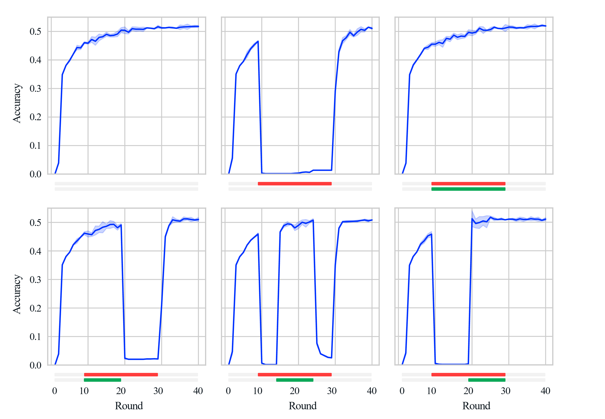

<div align="center">
<h1>Simulation of attacks and defences in Federated Learning</h1>
<h3>(anonymous version)</h3>
</div>

This codebase simulates the training of a model by Federated Learning in the presence of various attacks and defences.

---

### Installation

#### Direct installation

The required libraries can be directly installed with:

```bash
make install
```

To run an experiment, first modify the variables at the top of `Makefile` to reflect the resources you intend to use. Then, the 1994 Adult Census dataset experiment can be run with a backdoor attack and Krum defence using:

```bash
make run_adult_back_krum
```

> NOTE: in `src/datasets/cifar10.py` and `src/datasets/reddit.py` there are some paths beginning with `/datasets` used. These may need to be updated to point to suitable locations. Additionally, for the Reddit dataset, the FedScale reddit dataset must be downloaded at the path mentioned in `src/datasets/reddit.py`.

The experiment should result in an overall accuracy of 85% and a backdoor accuracy of 29%.

If this has already been setup on the CaMLSys cluster, the below command can be used

```bash
srun -c 16 --gres=gpu:2 -w ngongotaha bash scripts/slurm.sh make run_cifar_fair_none
```

#### Docker

A docker container is alternatively provided. It is still necessary to update the variables at the top of `Makefile` to reflect the resources you intend to use and update the paths mentioned in the above note in order to run the CIFAR10 and Reddit experiments. The example experiment can then be run with:

```bash
docker build -t fl_attacks .
```

The experiment should result in an overall accuracy of 85% and a backdoor accuracy of 29%.

### File structure

```
.
├── configs/
│   ├── templates/                      Template configs to be concatenated
│   │   └── ...
│   ├── default.yaml                    Default values for each field
│   └── defence_fairness_testing.yaml   Config for defence_fairness.py
├── scripts/
│   ├── gen_template.sh                 Generate a config file from a list of templates
│   └── slurm.sh                        Run command in python environment (for slurm)
├── src/
│   ├── datasets/
│   │   ├── __init__.py
│   │   ├── adult.py                    Download the 1994 Adult Census dataset
│   │   ├── cifar10.py                  Download the CIFAR-10 dataset
│   │   ├── reddit.py                   Download the Reddit comments dataset
│   │   ├── format_data.py              Split and organise datasets for the simulation
│   │   ├── typing.py                   Define the abstract dataset generator interface
│   │   └── util.py
│   ├── models/
│   │   ├── __init__.py
│   │   ├── fully_connected.py          Fully connected nn for the Adult Census dataset
│   │   ├── resnet_50.py                ResNet-50 (for CIFAR-10)
│   │   └── lstm.py                     2-layer LSTM for the Reddit dataset
│   ├── attacks/
│   │   ├── __init__.py
│   │   ├── backdoor_dataset.py         Modify a dataset to insert a backdoor
│   │   ├── unfair_dataset.py           Modify a dataset to introduce unfairness
│   │   ├── model_replacement.py        Model replacement attack
│   │   ├── update_prediction.py        Update prediction attack
│   │   └── typing.py                   Define the abstract attack interface
│   ├── defences/
│   │   ├── __init__.py
│   │   ├── trim_mean.py                Trimmed mean defence
│   │   ├── krum.py                     Krum defence
│   │   ├── diff_priv.py                Weak differential privacy defence
│   │   ├── fair_detect.py              Unfair update detection defence
│   │   └── typing.py                   Define the abstract defence interface
│   ├── client.py                       Client object and local training routine
│   ├── server.py                       Custom aggregation functions and client manager
│   ├── evaluation.py                   Centralised evaluation function
│   ├── util.py                         Debugging functions
│   ├── **defence_fairness.py**         Run fairness experiment with synthetic datasets
│   ├── **main.py**                     Run main defence testing experiment
│   └── **graph_gen.py**                Generate graphs from main.py checkpoints
├── Makefile                            Experiment run commands
└── pyproject.toml
```

### Adding new experiments

Each subpackage (`datasets`, `models`, ...) exports a dictionary of objects that implement the provided interface. To add a new experiment, implement the new functionality, add the object to the corresponding package's dictionary, and specify the option in the config file. The `main.py` file then runs the simulation, as below:

```python
datasets: Datasets = DATASETS[config.task.dataset.name](config)
loaders: DataLoaders = get_loaders(datasets, config)
model: nn.Module = MODELS[config.task.model.name]

attacks: list[Attack] = [ATTACKS[attack_config.name] for attack_config in config.attacks]
defences: list[Defence] = [DEFENCES[defence_config.name] for defence_config in config.defences]

attack_aggregators: list[tuple[int, AggregationWrapper]] = ...
defence_aggregators: list[tuple[int, AggregationWrapper]] = ...

strategy_cls: Type[Strategy] = AGGREGATORS[config.task.training.aggregator.name](config)
for i, w in defence_aggregators + attack_aggregators:
    strategy_cls = w(strategy_cls, i, config)

fl.simulation.start_simulation(
    client_fn=get_client_fn(model, loaders.train, config),
    strategy=strategy_cls( ... ),
    client_manager=AttackClientManager(),
    ...
)
```

### Results

Below shows the plots of a minority class accuracy generated by `graph_gen.save_minority_accuracy_plots` with the fairness attack (red) and Krum defence (green) added at different points during training. Full results are discussed in my dissertation.

<div align="center">

</div>
